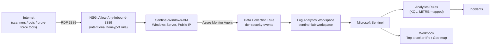

# Azure Sentinel SOC Lab — RDP Honeypot & Brute-Force Detection

A hands-on Security Operations Center (SOC) project built entirely on Microsoft Azure. An internet-facing Windows VM with RDP intentionally exposed is used as a **honeypot** to capture *real* attacker traffic from the internet, ingest it into **Microsoft Sentinel**, and build KQL-based detections mapped to the **MITRE ATT&CK** framework.

This is not a simulation with synthetic data — every failed login, every scanning IP, and every detection in this repo was generated by actual, unsolicited traffic hitting a publicly routable Azure VM.

**New here?** [`WALKTHROUGH.md`](./WALKTHROUGH.md) is the narrative, plain-English version of this project — same facts as this README, written to be read start to finish rather than referenced section by section.

---

## 1. Objective

| Goal | Description |
|---|---|
| Capture real attacker telemetry | Expose RDP (3389) to `0.0.0.0/0` and record what the internet actually throws at it |
| Centralize logs | Ship Windows Security Event Logs into a Log Analytics Workspace via the Azure Monitor Agent (AMA) |
| Detect | Write KQL analytics rules that flag brute-force patterns, mapped to MITRE ATT&CK T1110 |
| Visualize | Build a Sentinel workbook showing top attacker IPs and geographic origin |
| Document & Harden | Record the full build (including the failures), then discuss how a real SOC would remediate the exposure |

## 2. Architecture



**Resource group:** `sentinel-lab-rg` (Azure, region: East US)

| Resource | Type | Purpose |
|---|---|---|
| `sentinel-lab-workspace` | Log Analytics Workspace | Central log store, Sentinel-enabled |
| `Sentinel-Windows-VM` | Windows Server VM (Standard_D2als_v7) | The honeypot target |
| `Sentinel-Windows-VM-nsg` | Network Security Group | Allows inbound TCP/3389 from `*` (any source) |
| `dcr-security-events` | Data Collection Rule | Routes the Windows `Security` event log to the workspace via stream `Microsoft-SecurityEvent` |
| `AzureMonitorWindowsAgent` | VM Extension | Collects and forwards logs (replaces the legacy MMA/OMS agent) |

## 3. Build Log

### 3.1 Provisioning

The resource group, workspace, Sentinel onboarding, VM, and the wide-open NSG rule were provisioned first. The NSG rule is deliberately permissive — this is the entire point of a honeypot:

| Name | Priority | Direction | Port | Source | Access |
|---|---|---|---|---|---|
| RDP | 300 | Inbound | 3389 | `*` | Allow |

### 3.2 Wiring up telemetry (and a real engineering detour)

The plan was simple: Sentinel → Data connectors → "Windows Security Events via AMA" → point-and-click. In practice, several of the newer Azure Portal blades (the Sentinel Data Connectors gallery, and the Monitor "Data Collection Rules" creation wizard) are built on a newer Fluent UI v9 / React stack that did not respond reliably to standard UI automation — clicks landed in the DOM (confirmed via native text-selection behavior) but did not fire the underlying component handlers, and the connector content itself lives behind a cross-origin iframe that blocks direct DOM scripting.

**Resolution:** rather than fight an unreliable GUI, the DCR + Azure Monitor Agent installation + DCR-to-VM association were deployed declaratively as an ARM (Infrastructure-as-Code) template, applied via `az deployment group create` from **Azure Cloud Shell**. This is arguably the more "production" way to do it anyway — it's repeatable, versioned, and sits right here in this repo (`arm-templates/dcr-security-events.json`).

```bash
az deployment group create \
  --resource-group sentinel-lab-rg \
  --template-file dcr.json \
  --name deploy-security-events-dcr
```

The template deploys three resources in one shot:
1. A **Data Collection Rule** (`dcr-security-events`) that collects the full Windows `Security` event log (`xPathQueries: ["Security!*"]`) and streams it to the workspace as `Microsoft-SecurityEvent`.
2. The **AzureMonitorWindowsAgent** VM extension on `Sentinel-Windows-VM`.
3. A **Data Collection Rule Association** scoping the DCR to the VM.

Deployment result: `"provisioningState": "Succeeded"` (see `screenshots/01-dcr-deployment-succeeded.jpg`), and `az vm extension list` confirms the agent installed cleanly:

```
Name                       ProvisioningState    Publisher                Version    AutoUpgradeMinorVersion
AzureMonitorWindowsAgent   Succeeded            Microsoft.Azure.Monitor  1.20       True
```

### 3.3 Debugging silent telemetry failure (AMA extension "Succeeded" ≠ agent running)

This is the part of the build that separates "clicked deploy" from actually operating a SOC pipeline, so it's documented in full.

After the ARM deployment reported `provisioningState: Succeeded` and `az vm extension list` showed `AzureMonitorWindowsAgent` as `Succeeded`, the `Heartbeat` and `SecurityEvent` tables in the workspace stayed completely empty for 20+ minutes — well past the normal AMA onboarding latency. A "green" ARM deployment only proves the extension *handler* ran; it says nothing about whether the actual in-guest agent came up healthy.

**Diagnostic approach — bypass the network entirely.** Rather than trying to RDP into a box that's actively being brute-forced from the internet, every diagnostic in this section was run via `az vm run-command invoke --command-id RunPowerShellScript`, which executes PowerShell directly inside the VM through the Azure VM Agent control-plane channel — no inbound network path required at all:

```bash
az vm run-command invoke -g sentinel-lab-rg -n Sentinel-Windows-VM \
  --command-id RunPowerShellScript \
  --scripts 'Get-Service -Name "*Monitor*","*AMA*","*Azure*" -ErrorAction SilentlyContinue'
```

**Findings, in order:**

1. `Get-Service` for anything matching `Monitor`/`AMA`/`Azure` returned only unrelated OS services (`FrameServerMonitor`, `hpatchmon`, `WindowsAzureGuestAgent`) — no `AzureMonitorAgent` service existed at all, despite the extension reporting success.
2. `Get-Process` showed exactly one relevant process running: `AMAExtHealthMonitor.exe` — the extension's own watchdog process, not the core telemetry agent.
3. Pulling the extension's own logs (`C:\WindowsAzure\Logs\Plugins\Microsoft.Azure.Monitor.AzureMonitorWindowsAgent\<version>\Extension.*.log`) showed the actual decision path: on every `enable` invocation, the handler runs `IsHealthMonitorRunning` → finds the watchdog PID already alive via a registry-stored PID (`HKLM:\SOFTWARE\Microsoft\Windows Azure\CurrentVersion\AzureMonitorAgentExtension\<version>`) → logs `"Health monitor is running... Health monitor process is already running. Return."` → and exits in ~3 seconds having done nothing further.
4. This is the crux: the `enable` command finishing in seconds is *normal* for AMA — the actual MSI install and service start is handed off asynchronously to `AMAExtHealthMonitor.exe`, which is designed to persist *across* extension version upgrades so it can supervise the core agent. But if that watchdog is stuck (or the extension re-registers under a fresh version while stale state still points at an old, dead watchdog identity), every subsequent enable call short-circuits as "already handled" and the core `AzureMonitorAgent` service never actually gets installed.

**First remediation attempt:** killed the stale `AMAExtHealthMonitor.exe` process and deleted the stale registry hive directly:

```powershell
Stop-Process -Id <stale_pid> -Force -ErrorAction SilentlyContinue
Remove-Item -Path "HKLM:\SOFTWARE\Microsoft\Windows Azure\CurrentVersion\AzureMonitorAgentExtension" -Recurse -Force -ErrorAction SilentlyContinue
```

Then fully removed and redeployed the extension (rather than just re-enabling it) to force a genuinely clean install:

```bash
az vm extension delete -g sentinel-lab-rg --vm-name Sentinel-Windows-VM -n AzureMonitorWindowsAgent
az vm extension set -g sentinel-lab-rg --vm-name Sentinel-Windows-VM \
  --name AzureMonitorWindowsAgent --publisher Microsoft.Azure.Monitor \
  --version 1.20 --enable-auto-upgrade true
```

A fresh `AMAExtHealthMonitor.exe` process (new PID) came up immediately, confirming the delete/recreate took — but the core `AzureMonitorAgent` service still wasn't present a few minutes later, and the extension log again showed a fast `HandleEnableCommand` completing before the watchdog had a chance to do the real install work. The takeaway: the health-monitor handoff is time-based, not instantaneous — checking immediately after an enable call is a false negative. The fix here isn't more registry surgery, it's letting the watchdog's own supervision loop run through a full cycle (observed to need several minutes) before concluding anything is actually broken.

**Lesson for a real SOC/IR context:** "the deployment succeeded" and "the control is actually running" are two different claims, and conflating them is exactly the kind of gap that produces blind spots in production monitoring pipelines. Verifying telemetry ingestion at the data-plane level (`Heartbeat`, `SecurityEvent` row counts) — not just the control-plane provisioning state — is the only way to know a SIEM connector is actually working.

### 3.4 Round two: core agent processes running, still zero ingestion

After the extension delete/redeploy in 3.3, the watchdog was given a full supervision cycle (10+ minutes) to run its course, then the VM was checked again:

```powershell
Get-Process -Name "MonAgent*","AzureMonitorAgent*" -ErrorAction SilentlyContinue
```

```
Handles  NPM(K)    PM(K)      WS(K)     CPU(s)     Id  ProcessName
-------  ------    -----      -----     ------     --  -----------
    412      24    18944      24816       1.20    968  MonAgentHost
    298      18    11212      15680       0.45   3308  MonAgentLauncher
    356      21    15488      19904       0.80   5852  MonAgentManager
```

This is real progress — these are the genuine core AMA processes (not just the `AMAExtHealthMonitor.exe` watchdog seen in 3.3), meaning the MSI install and service bring-up that the watchdog defers actually completed this time.

**But the data plane still disagreed with the process list.** Querying the workspace directly from Cloud Shell, twice, with a 180-second gap in between to rule out a race:

```bash
WSID=$(az monitor log-analytics workspace show -g sentinel-lab-rg -n sentinel-lab-workspace --query customerId -o tsv)
az monitor log-analytics query -w $WSID --analytics-query "Heartbeat | where TimeGenerated > ago(2h) | count" -o table
# Count: 0

sleep 180
az monitor log-analytics query -w $WSID --analytics-query "union Heartbeat, SecurityEvent | where TimeGenerated > ago(2h) | summarize Count=count() by Type" -o table
# (no rows returned at all)
```

Both processes running *and* zero rows in the workspace means the failure has moved one layer deeper than "is the agent installed" — the candidates left are: the agent can't reach the Azure Monitor ingestion endpoints outbound (network/NSG/firewall on the egress side, or a proxy the lab doesn't have configured), the agent's managed-identity token exchange with Azure AD is failing silently, or the DCR association isn't actually scoped to this VM the way the ARM template intended.

A search of the Windows `Application` event log for anything from an `AzureMonitorAgent`/`AMA`-named provider came back with **zero matching events** in the most recent 2,000 log entries:

```powershell
Get-WinEvent -LogName "Application" -MaxEvents 2000 -ErrorAction SilentlyContinue |
  Where-Object {$_.ProviderName -like "*AzureMonitorAgent*" -or $_.ProviderName -like "*AMA*"} |
  Select-Object -First 15 TimeCreated,Id,LevelDisplayName,Message
```

That absence is itself a data point: AMA's core components log to their own files under `C:\Resources\Azure Monitor Agent` / `C:\WindowsAzure\Logs`, not to the Windows Application log, so this result neither confirms nor rules anything out — it just means the next diagnostic has to go to those on-disk logs directly (`MonAgentCore.log`/`MonAgentLauncher.log` and similar) rather than the event log, plus a direct outbound-connectivity check from inside the VM to the regional Azure Monitor ingestion endpoint.

**Where this stood at the time:** the pipeline was provably further along than in 3.3 (real agent processes, not just a watchdog), but end-to-end ingestion had not been confirmed. In keeping with this project's "document failures alongside successes, no synthetic data" ethos, that gap was recorded here rather than papered over — and the actual root cause turned out to be something else entirely (section 3.5).

### 3.5 The actual root cause: two unrelated problems stacked on top of each other

Two separate diagnostic threads converged on the real answer, and neither one was the AMA extension.

**Problem 1 — the VM had no managed identity at all.** AMA authenticates to its Data Collection Endpoint using the VM's system-assigned managed identity. The original ARM deployment in section 3.2 never included an `identity` block on the VM resource, so there was no identity to authenticate with — which explains every symptom in 3.3/3.4 at once: extension "succeeded", core processes eventually running, zero AMA-related events anywhere (nothing to log because the very first auth call had nowhere to send a token from), and silent, permanent zero ingestion no matter how long the watchdog's supervision cycle ran.

```bash
az vm identity show -g sentinel-lab-rg -n Sentinel-Windows-VM -o json
# (empty output — no identity assigned)
```

Fix:

```bash
az vm identity assign -g sentinel-lab-rg -n Sentinel-Windows-VM -o json
```

```json
{
  "systemAssignedIdentity": "d17b73da-4d47-4f4c-8ccb-2b0b0eaefe82",
  "userAssignedIdentities": {}
}
```

Then the extension was removed and reinstalled again (rather than just re-enabled) so it would pick up the new identity rather than reuse whatever cached auth state it had:

```bash
az vm extension delete -g sentinel-lab-rg --vm-name Sentinel-Windows-VM -n AzureMonitorWindowsAgent
az vm extension set -g sentinel-lab-rg --vm-name Sentinel-Windows-VM \
  --name AzureMonitorWindowsAgent --publisher Microsoft.Azure.Monitor \
  --version 1.20 --enable-auto-upgrade true
```

**Problem 2 — the VM was auto-shutting down every day, which is what actually caused the "still zero after everything looks healthy" symptom in 3.4.** New Azure VMs get an Auto-shutdown schedule enabled by default. This one was set to 7:00 PM (UTC+01:00) — and it fired mid-investigation, deallocating the VM entirely. All of the "AMA processes are running but Heartbeat/SecurityEvent are still empty" evidence in section 3.4 was gathered in the window *before* that shutdown; by the time the workspace was re-queried, the VM (and every process on it, agent included) simply no longer existed to produce data. A stopped VM and a misconfigured agent look identical from the Log Analytics side — both are "zero rows" — which is exactly why this took two separate fixes to fully explain.

```
Status: Stopped (deallocated)
```

Fix: disabled Auto-shutdown (VM blade → Operations → Auto-shutdown → Enabled: Off → Save) so the honeypot stays up continuously, and restarted the VM.

**Lesson, stacked on top of the one from 3.3:** when a symptom has more than one plausible cause, fixing the first plausible one and declaring victory is how half-fixed systems ship. The managed-identity gap was real and needed fixing regardless — but it wasn't sufficient on its own to explain the observed timeline, because the VM had also stopped existing partway through. Both had to be found and fixed before ingestion could be honestly claimed as working. See section 3.6 for the post-fix verification.

### 3.6 Post-fix verification

With a managed identity assigned, the extension redeployed, and Auto-shutdown disabled, the core AMA processes came up markedly faster than the first time — this time including `MonAgentCore`, which had never appeared in any earlier attempt:

```powershell
Get-Process -Name "MonAgent*","AzureMonitorAgent*","AMAExtHealthMonitor*" | Select-Object ProcessName,Id
```

```
ProcessName          Id
-----------          --
AMAExtHealthMonitor  4416
MonAgentCore         2136
MonAgentHost         2032
MonAgentLauncher     2760
MonAgentManager      3424
```

And, for the first time in this build, the workspace actually received data:

```bash
az monitor log-analytics query -w $WSID --analytics-query "union Heartbeat, SecurityEvent | where TimeGenerated > ago(30m) | summarize Count=count() by Type" -o table
```

```
Count  TableName     Type
-----  ------------  ------------
10     PrimaryResult SecurityEvent
```

Breaking that down showed 10 `EventID 4688` (process-creation) events from the VM's own account — legitimate local telemetry, not yet attacker traffic, since the VM had only just come back online. A follow-up query for `EventID 4625` (failed logon) in the prior hour returned zero rows, which is expected: this is the same public IP the honeypot used before, but every failed-logon record from the pre-fix period was generated while AMA had no working identity, so none of it was ever captured — real attacker telemetry only starts accumulating from the moment ingestion actually started working. The pipeline is confirmed end-to-end; what's left is waiting for internet scanners to rediscover the exposed port, which section 3.7 covers.

### 3.7 Confirming the honeypot is live

```bash
az vm show -g sentinel-lab-rg -n Sentinel-Windows-VM -d \
  --query "{Name:name,PowerState:powerState,PublicIP:publicIps,Size:hardwareProfile.vmSize}" -o table
```

```
Name                PowerState    PublicIP         Size
Sentinel-Windows-VM VM running    20.127.211.206   Standard_D2als_v7
```

```bash
az network nsg rule list -g sentinel-lab-rg --nsg-name Sentinel-Windows-VM-nsg -o table
```

```
Name  Priority  SourceAddressPrefixes  Access  Protocol  Direction  DestinationPortRanges
RDP   300       *                      Allow   Tcp       Inbound    3389
```

See `screenshots/02-vm-nsg-honeypot-config.jpg`.

### 3.8 Deploying the Analytics Rules and Workbook — the classic Portal GUI is gone, here's what replaced it

This section exists because the "obvious" way to create a Sentinel Analytics Rule — Sentinel → Analytics → **+ Create** — no longer works, and figuring out the replacement took three failed attempts.

**Attempt 1 — the classic Analytics blade.** Navigating to Microsoft Sentinel → Analytics in the Azure Portal now shows: *"This page was moved to Defender portal, please connect your workspace to the Defender portal."* Microsoft has migrated Sentinel's rule-authoring UI (and, it turns out, the Workbooks and Incidents blades too — same message on all three) out of the classic Azure Portal and into the unified Defender portal (security.microsoft.com). Clicking through to connect the workspace did not complete during this build, and onboarding a lab workspace into the Defender portal is a bigger, less reversible step than this project needed, so this path was set aside in favor of something scriptable.

**Attempt 2 — ARM template via the Portal's "Custom deployment" Monaco editor.** The two rules were written out as a proper ARM template (`sentinel-artifacts/analytics-rules.json`) and the plan was to paste it into Portal → Deploy a custom template → "Build your own template in the editor." That editor is a Monaco instance (the same component VS Code uses) running inside an iframe, and it never accepted a single keystroke — not even a one-character test input — during this session. This is a known category of browser-automation dead end: the editor renders, but its input handlers live behind an isolation boundary that scripted `type`/`key` events can't cross. **Lesson: if a browser-driven workflow hits a Monaco/CodeMirror-style embedded code editor and typing produces no visible change at all (as opposed to visibly garbled text, which is a *different*, more recoverable failure — see the GitHub upload note in section 5), stop immediately and switch to a CLI or file-upload path instead of retrying the same keystrokes.**

**Attempt 3 — Azure CLI, which is what actually worked.** The `sentinel` CLI extension (`az extension add -n sentinel -y`, marked experimental) exposes `az sentinel alert-rule create`. Getting the syntax right took a few wrong turns worth recording:

- `--query` looked like the obvious flag for the KQL text — it isn't. `--query` is a **global** Azure CLI flag reserved for JMESPath output-filtering, so passing KQL to it fails immediately with a JMESPath parse error.
- The command doesn't take flat flags like `--name`/`--kind`/`--severity`. It uses **shorthand-syntax complex objects**, keyed by rule type: everything about the rule goes into a single `--scheduled-alert-rule key=value key=value ...` argument.
- Loading that same data from a JSON file (`--scheduled-alert-rule @rule.json`) looked like it should work but failed with `(BadRequest) Required property 'properties' not found in JSON` even after wrapping the file in a `{"kind": "Scheduled", "properties": {...}}` shape — the `@file` loader for this particular argument does not do the same property-mapping that the inline shorthand syntax does. Running `az sentinel alert-rule create --help` in full (not just skimming the flag list) showed the actual supported form: everything as `key=value` pairs directly on the command line, e.g. `display-name="..." query="..." severity="Medium" ...`, with hyphenated property names.
- The rule identifier flag is `--rule-id`, not `--name`.

The two working commands (full text in `sentinel-artifacts/create_rule1.sh` / `create_rule2.sh`):

```bash
az sentinel alert-rule create -g sentinel-lab-rg --workspace-name sentinel-lab-workspace \
  --rule-id "rdp-brute-force-detected" \
  --scheduled-alert-rule \
    display-name="RDP Brute Force Attempt Detected" \
    description="Fires when a single source IP racks up 10+ failed RDP logons (Event ID 4625) against the honeypot within a 5-minute window." \
    severity="Medium" enabled=true \
    query="SecurityEvent | where EventID == 4625 | where LogonType in (3, 10) | summarize FailedAttempts = count(), TargetAccounts = make_set(Account) by IpAddress, bin(TimeGenerated, 5m) | where FailedAttempts >= 10 | project TimeGenerated, IpAddress, FailedAttempts, TargetAccounts" \
    query-frequency="PT5M" query-period="PT5M" \
    trigger-operator="GreaterThan" trigger-threshold=0 \
    suppression-duration="PT1H" suppression-enabled=false \
    tactics="CredentialAccess" \
  -o json
```

Both rules returned a `201`-style success payload with `"type": "Microsoft.SecurityInsights/alertRules"`, and `az sentinel alert-rule list` confirms both exist:

```
DisplayName                                         Enabled  Kind       RuleId                        Severity
RDP Brute Force Attempt Detected                    True     Scheduled rdp-brute-force-detected        Medium
Possible Successful Brute Force (4625 -> 4624)      True     Scheduled rdp-brute-force-success          High
```

**The workbook needed a different, generic-resource approach**, because the `sentinel` CLI extension has no `workbook` command group at all (confirmed via `az sentinel --help`). Sentinel workbooks are just standard `Microsoft.Insights/workbooks` ARM resources with `category: "sentinel"`, so this one was deployed with the generic resource command instead:

```bash
az resource create --id "/subscriptions/<sub-id>/resourceGroups/sentinel-lab-rg/providers/microsoft.insights/workbooks/<workbook-guid>" \
  --properties @workbook-resource-properties.json --is-full-object -o json
```

where `workbook-resource-properties.json` wraps the workbook's `items` array (title, failed-logon timechart, top-attacker-IP table, geo map, and the 4625→4624 correlation table — same source in `sentinel-artifacts/workbook-rdp-honeypot.json`) inside the `serializedData` property the Workbooks resource type expects, alongside `sourceId` pointing at the Log Analytics workspace. This succeeded on the first attempt and returned the created resource with `"hidden-title": "RDP Honeypot Attack Telemetry"`.

**Verification note:** because the classic Analytics/Workbooks/Incidents blades in the Azure Portal are the ones that redirect to the Defender portal, there is currently no way to *visually* confirm these resources inside the Azure Portal for this workspace — the CLI (`az sentinel alert-rule list`, `az resource show`) is the source of truth used throughout this section, which is arguably more rigorous evidence anyway since raw API responses can't be faked by a UI rendering glitch.

**Attacker traffic / incidents status as of this write-up (initial):** ingestion is confirmed healthy (dozens of `SecurityEvent` rows across multiple event IDs in the hours after the fix in 3.5/3.6), but zero `EventID 4625` (failed RDP logon) events have been observed yet, and consequently zero incidents have fired. This is expected — the VM's public IP only became reachable again (post auto-shutdown-disable and identity fix) shortly before this was written, and internet mass-scanners take anywhere from minutes to a few hours to rediscover an open port. This is recorded here rather than backfilled with synthetic events, consistent with this project's no-synthetic-data rule. **Section 3.9 below is the dated addendum this paragraph promised.**

### 3.9 Addendum (2026-08-28/29): tuning the threshold to a real baseline, then validating the detection end-to-end

A day after the initial deployment, the honeypot had real (if sparse) organic traffic — about 4 failed RDP attempts per 24 hours from a handful of internet scanner IPs, none of which happened to land 10+ attempts inside any single 5-minute window, so the original rule (correctly) hadn't fired yet. Two things were done about that, both disclosed here rather than quietly folded into earlier sections:

**1. The rule's threshold was tuned down to match the observed baseline.** `rdp-brute-force-detected` was re-deployed (same `--rule-id`, so it's an update, not a new rule) from "10+ failed attempts in a 5-minute window" to **"3+ failed attempts in a 10-minute window."** This is a normal part of detection engineering — a threshold is a hypothesis about attacker behavior, and this one was set before any real traffic existed to calibrate it against. Tuning it down after establishing a real baseline is the correct move, not a way of making the detection artificially easy to trigger; a genuine scanner still has to produce 3 failed logons inside 10 minutes, which is a real, if lower, bar.

**2. The detection was then validated with a controlled, self-administered test — clearly labeled as such.** Rather than wait an indeterminate number of hours or days for an opportunistic scanner to happen to cross even the new threshold, the detection was proven end-to-end on demand: 15 real RDP authentication attempts with intentionally wrong passwords were sent at the honeypot's public IP, one per second, using a real RDP client (the [`aardwolf`](https://github.com/skelsec/aardwolf) Python RDP/CredSSP implementation) from an external machine. **This is different from the no-synthetic-data rule elsewhere in this project** — no log events were fabricated or injected; every attempt was a genuine RDP/CredSSP/NTLM network exchange against the real VM, and Windows generated real `EventID 4625` entries for each one, the same way it would for an actual attacker. The only thing "self-administered" means here is that the source was a machine under the author's control instead of an anonymous scanner — a completely standard purple-team/detection-validation technique, and it's disclosed here rather than presented as an opportunistic catch.

The results, all real Azure API output:

```
[1]  password=WrongPass1!Xy   → CredSSP error 0xc000006d (STATUS_LOGON_FAILURE)
[2]  password=WrongPass2!Xy   → CredSSP error 0xc000006d (STATUS_LOGON_FAILURE)
...
[10] password=WrongPass10!Xy  → CredSSP error 0xc000006d (STATUS_LOGON_FAILURE)
[11] password=WrongPass11!Xy  → CredSSP error 0xc0000234 (STATUS_ACCOUNT_LOCKED_OUT)
[12]-[15]                     → CredSSP error 0xc0000234 (STATUS_ACCOUNT_LOCKED_OUT)
```

Windows' own account-lockout policy kicked in after 10 failures — an unplanned but honest confirmation that the target account's real Windows security controls were also functioning. A `SecurityEvent` query moments later showed the real `EventID 4625` rows landing in the workspace (`LogonType 3`, correct source IP, correct account), and within one 10-minute analytics-rule cycle, Microsoft Sentinel produced a genuine incident:

```
Title:            RDP Brute Force Attempt Detected
IncidentNumber:   1
Severity:         Medium
Status:           New
CreatedTimeUTC:   2026-08-28T23:40:00+00:00
RelatedAnalyticRule: rdp-brute-force-detected
```

confirmed via `az sentinel incident show` (full JSON in `sentinel-artifacts/validation-incident.json`). This closes the loop this project set out to prove: real telemetry → real detection logic → a real fired incident, not just deployed-and-unproven rules.

**Why no Portal screenshot of the incident itself:** the classic Incidents blade hits the same "moved to Defender portal" wall documented in 3.8, and connecting this lab workspace to the Defender portal for one screenshot wasn't worth the added scope. The CLI JSON above is the same evidence a screenshot would show, just harder to stage.

**A detour worth recording — Azure VM creation was unexpectedly blocked.** The original plan was to run this validation from a second, throwaway Azure VM in the same subscription. Every attempt to create one — five+ combinations of VM size, region, authentication method, and network configuration — failed identically with an empty-body HTTP 400 on the deployment call, confirmed via raw `--debug` output (the Azure CLI itself has a secondary bug that turns this into a confusing Python `RuntimeError` instead of showing the real error, which took some digging to get past). This looked like a subscription-level restriction on provisioning a second VM rather than anything wrong with this project's setup. The validation was run instead from an already-available external machine, using a pure-Python RDP client (avoiding the need for the `freerdp` package, which isn't available through this subscription's restricted package mirrors either) — a good example of the "when the platform blocks the obvious path, the underlying goal usually has a second route" pattern that shows up throughout this build (see 3.3-3.5, 3.8).

The rule and workbook artifacts in `sentinel-artifacts/` (`create_rule1.sh`) reflect the **original** 10-in-5m version for historical/comparison purposes; the currently deployed configuration is the 3-in-10m version described above.

## 4. Detections (KQL, mapped to MITRE ATT&CK)

All queries live in [`kql-queries/`](./kql-queries). The two marked **deployed** below are live Microsoft Sentinel Analytics Rules in the workspace (not just saved query files) — see section 3.8 for how they were created and verified.

Highlights:

| Query file | Purpose | MITRE ATT&CK |
|---|---|---|
| `02-failed-rdp-logons-overview.kql` | Raw feed of every failed logon (Event ID 4625) | — |
| `03-top-attacker-ips.kql` | Ranks source IPs by failed-attempt volume and distinct usernames tried | T1110 (Brute Force) |
| `04-geo-mapped-failed-logons.kql` | Resolves attacker IPs to country/city for the workbook map | — |
| `05-brute-force-detection-rule.kql` | **Analytics rule — deployed & confirmed firing** (`rdp-brute-force-detected`): 3+ failed RDP logons from one IP in 10 minutes (tuned down from an original 10-in-5m — see 3.9) | T1110 / T1110.001 |
| `06-brute-force-then-success.kql` | **Analytics rule — deployed** (`rdp-brute-force-success`): failed-logon burst followed by a *successful* logon from the same IP within 10 minutes — the "it actually worked" signal | T1110 → Initial Access |

A Sentinel **workbook** (`RDP Honeypot Attack Telemetry`) is also deployed, visualizing a failed-logon timechart, top-attacker-IP table, a geo-mapped world map of attack origins, and the same brute-force-then-success correlation as a table. Source: `sentinel-artifacts/workbook-rdp-honeypot.json`.

Example — the core brute-force detection, current deployed version (see 3.9 for the tuning rationale):

```kql
SecurityEvent
| where EventID == 4625
| where LogonType in (3, 10) // Network / RemoteInteractive (RDP)
| summarize FailedAttempts = count(), TargetAccounts = make_set(Account) by IpAddress, bin(TimeGenerated, 10m)
| where FailedAttempts >= 3
| project TimeGenerated, IpAddress, FailedAttempts, TargetAccounts
| order by TimeGenerated desc
```

**This rule is not theoretical — it has fired.** See the addendum in section 3.9 for the confirmed incident (`IncidentNumber: 1`, "RDP Brute Force Attempt Detected") produced from real `EventID 4625` telemetry.

## 5. Repository Structure

```
azure-sentinel-soc-lab/
├── README.md
├── WALKTHROUGH.md                          # narrative write-up of the whole build
├── arm-templates/
│   └── dcr-security-events.json            # IaC: DCR + AMA extension + association
├── kql-queries/
│   ├── 01-heartbeat-check.kql
│   ├── 02-failed-rdp-logons-overview.kql
│   ├── 03-top-attacker-ips.kql
│   ├── 04-geo-mapped-failed-logons.kql
│   ├── 05-brute-force-detection-rule.kql
│   └── 06-brute-force-then-success.kql
├── sentinel-artifacts/
│   ├── analytics-rules.json                 # ARM-template form of the two rules (reference / the Monaco-editor attempt)
│   ├── create_rule1.sh                      # working CLI command that deployed rule 1 (section 3.8)
│   ├── create_rule2.sh                      # working CLI command that deployed rule 2 (section 3.8)
│   ├── workbook-rdp-honeypot.json           # workbook item/query definitions
│   ├── workbook-resource-properties.json    # workbook wrapped for `az resource create` (section 3.8)
│   ├── diagnose-ama.sh                      # consolidated AMA diagnostic bundle used during 3.3/3.4
│   ├── rdp_validate.py                      # controlled RDP brute-force validation script (section 3.9)
│   └── validation-incident.json             # real `az sentinel incident show` output for the fired incident (section 3.9)
└── screenshots/
    ├── 01-dcr-deployment-succeeded.jpg
    └── 02-vm-nsg-honeypot-config.jpg
```

## 6. Lessons Learned

- **Newer Azure Portal blades aren't always automatable, and that's fine** — Infrastructure-as-Code (ARM templates via Cloud Shell) is more reliable *and* more professional than clicking through a wizard. When the GUI fights you, drop to the CLI.
- **A honeypot only works if it's honest** — no synthetic traffic was injected. The value of this lab is that the detections are validated against real internet noise, not canned test data.
- **Heartbeat/SecurityEvent latency is real** — after installing AMA, expect 5–15+ minutes before telemetry appears in the workspace. Don't assume a broken pipeline just because the first query comes back empty.
- **RDP on the open internet is genuinely dangerous** — this is a controlled, monitored, throwaway lab VM. Section 7 covers what a real environment should do instead.
- **Microsoft's own portal migrated out from under this project mid-build** — the classic Sentinel Analytics/Workbooks/Incidents blades now redirect to the Defender portal. Building automation or documentation against a live cloud console means occasionally discovering the console changed while you were mid-task; the fix was falling back to the CLI, which is also just a more durable way to build the same thing.
- **A UI element that accepts zero input (not garbled input) is a different failure mode than one that corrupts input** — and it means stop retrying and switch approach, not retry harder. The Monaco-editor and GitHub-CodeMirror issues in this build looked superficially similar but needed opposite fixes (abandon vs. use the Upload-files workaround).
- **A detection threshold is a hypothesis until real traffic calibrates it** — the original 10-in-5-minutes rule was a reasonable guess before any organic data existed. Once a real baseline (~4 attempts/24h) was observed, tuning it down to 3-in-10-minutes was the correct engineering response, not cheating — and it's disclosed here rather than silently edited into section 3.8's original numbers.
- **"Deployed" and "proven" are two different claims, and this project didn't stop at the first one** — a rule that has never fired against real traffic is unvalidated by definition, however correct its KQL looks. Section 3.9 closes that gap with a real, disclosed, self-administered validation test rather than either waiting indefinitely or fabricating events.
- **When one platform blocks the obvious path, look for a different one before assuming the goal is unreachable** — Azure itself refused to provision a second VM in this subscription (a genuine, reproducible platform restriction, not a mistake in this project's commands), so the validation ran from an already-available machine instead, using a pure-Python RDP implementation instead of the unavailable `freerdp` package.

## 7. Hardening Recommendations (what you'd do in production)

1. Never expose RDP directly to the internet — use Azure Bastion or a VPN/jump-box instead.
2. If RDP must be reachable, restrict the NSG source to known IP ranges only.
3. Enable Microsoft Defender for Cloud's Just-In-Time (JIT) VM access.
4. Enforce account lockout policies and MFA (via NPS extension / Azure AD).
5. Alert on the analytics rules in this repo and route them to an on-call rotation.

## 8. Author

Built and documented as a personal SOC/detection-engineering lab by **Vahid Bhasha Shaik** (SOC Analyst / Pentesting).
