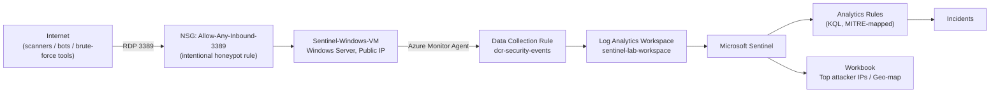

# Azure Sentinel SOC Lab — RDP Honeypot & Brute-Force Detection

A hands-on Security Operations Center (SOC) project built entirely on Microsoft Azure. An internet-facing Windows VM with RDP intentionally exposed is used as a **honeypot** to capture *real* attacker traffic from the internet, ingest it into **Microsoft Sentinel**, and build KQL-based detections mapped to the **MITRE ATT&CK** framework.

This is not a simulation with synthetic data — every failed login, every scanning IP, and every detection in this repo was generated by actual, unsolicited traffic hitting a publicly routable Azure VM.

---

## 1. Objective

| Goal | Description |
|---|---|
| Capture real attacker telemetry | Expose RDP (3389) to `0.0.0.0/0` and record what the internet actually throws at it |
| Centralize logs | Ship Windows Security Event Logs into a Log Analytics Workspace via the Azure Monitor Agent (AMA) |
| Detect | Write KQL analytics rules that flag brute-force patterns, mapped to MITRE ATT&CK T1110 |
| Visualize | Build a Sentinel workbook showing top attacker IPs and geographic origin |
| Document & Harden | Record the full build (including the failures), then discuss how a real SOC would remediate the exposure |

## 2. Architecture



**Resource group:** `sentinel-lab-rg` (Azure, region: East US)

| Resource | Type | Purpose |
|---|---|---|
| `sentinel-lab-workspace` | Log Analytics Workspace | Central log store, Sentinel-enabled |
| `Sentinel-Windows-VM` | Windows Server VM (Standard_D2als_v7) | The honeypot target |
| `Sentinel-Windows-VM-nsg` | Network Security Group | Allows inbound TCP/3389 from `*` (any source) |
| `dcr-security-events` | Data Collection Rule | Routes the Windows `Security` event log to the workspace via stream `Microsoft-SecurityEvent` |
| `AzureMonitorWindowsAgent` | VM Extension | Collects and forwards logs (replaces the legacy MMA/OMS agent) |

## 3. Build Log

### 3.1 Provisioning

The resource group, workspace, Sentinel onboarding, VM, and the wide-open NSG rule were provisioned first. The NSG rule is deliberately permissive — this is the entire point of a honeypot:

| Name | Priority | Direction | Port | Source | Access |
|---|---|---|---|---|---|
| RDP | 300 | Inbound | 3389 | `*` | Allow |

### 3.2 Wiring up telemetry (and a real engineering detour)

The plan was simple: Sentinel → Data connectors → "Windows Security Events via AMA" → point-and-click. In practice, several of the newer Azure Portal blades (the Sentinel Data Connectors gallery, and the Monitor "Data Collection Rules" creation wizard) are built on a newer Fluent UI v9 / React stack that did not respond reliably to standard UI automation — clicks landed in the DOM (confirmed via native text-selection behavior) but did not fire the underlying component handlers, and the connector content itself lives behind a cross-origin iframe that blocks direct DOM scripting.

**Resolution:** rather than fight an unreliable GUI, the DCR + Azure Monitor Agent installation + DCR-to-VM association were deployed declaratively as an ARM (Infrastructure-as-Code) template, applied via `az deployment group create` from **Azure Cloud Shell**. This is arguably the more "production" way to do it anyway — it's repeatable, versioned, and sits right here in this repo (`arm-templates/dcr-security-events.json`).

```bash
az deployment group create \
  --resource-group sentinel-lab-rg \
  --template-file dcr.json \
  --name deploy-security-events-dcr
```

The template deploys three resources in one shot:
1. A **Data Collection Rule** (`dcr-security-events`) that collects the full Windows `Security` event log (`xPathQueries: ["Security!*"]`) and streams it to the workspace as `Microsoft-SecurityEvent`.
2. The **AzureMonitorWindowsAgent** VM extension on `Sentinel-Windows-VM`.
3. A **Data Collection Rule Association** scoping the DCR to the VM.

Deployment result: `"provisioningState": "Succeeded"` (see `screenshots/01-dcr-deployment-succeeded.jpg`), and `az vm extension list` confirms the agent installed cleanly:

```
Name                       ProvisioningState    Publisher                Version    AutoUpgradeMinorVersion
AzureMonitorWindowsAgent   Succeeded            Microsoft.Azure.Monitor  1.20       True
```

### 3.3 Debugging silent telemetry failure (AMA extension "Succeeded" ≠ agent running)

This is the part of the build that separates "clicked deploy" from actually operating a SOC pipeline, so it's documented in full.

After the ARM deployment reported `provisioningState: Succeeded` and `az vm extension list` showed `AzureMonitorWindowsAgent` as `Succeeded`, the `Heartbeat` and `SecurityEvent` tables in the workspace stayed completely empty for 20+ minutes — well past the normal AMA onboarding latency. A "green" ARM deployment only proves the extension *handler* ran; it says nothing about whether the actual in-guest agent came up healthy.

**Diagnostic approach — bypass the network entirely.** Rather than trying to RDP into a box that's actively being brute-forced from the internet, every diagnostic in this section was run via `az vm run-command invoke --command-id RunPowerShellScript`, which executes PowerShell directly inside the VM through the Azure VM Agent control-plane channel — no inbound network path required at all:

```bash
az vm run-command invoke -g sentinel-lab-rg -n Sentinel-Windows-VM \
  --command-id RunPowerShellScript \
  --scripts 'Get-Service -Name "*Monitor*","*AMA*","*Azure*" -ErrorAction SilentlyContinue'
```

**Findings, in order:**

1. `Get-Service` for anything matching `Monitor`/`AMA`/`Azure` returned only unrelated OS services (`FrameServerMonitor`, `hpatchmon`, `WindowsAzureGuestAgent`) — no `AzureMonitorAgent` service existed at all, despite the extension reporting success.
2. `Get-Process` showed exactly one relevant process running: `AMAExtHealthMonitor.exe` — the extension's own watchdog process, not the core telemetry agent.
3. Pulling the extension's own logs (`C:\WindowsAzure\Logs\Plugins\Microsoft.Azure.Monitor.AzureMonitorWindowsAgent\<version>\Extension.*.log`) showed the actual decision path: on every `enable` invocation, the handler runs `IsHealthMonitorRunning` → finds the watchdog PID already alive via a registry-stored PID (`HKLM:\SOFTWARE\Microsoft\Windows Azure\CurrentVersion\AzureMonitorAgentExtension\<version>`) → logs `"Health monitor is running... Health monitor process is already running. Return."` → and exits in ~3 seconds having done nothing further.
4. This is the crux: the `enable` command finishing in seconds is *normal* for AMA — the actual MSI install and service start is handed off asynchronously to `AMAExtHealthMonitor.exe`, which is designed to persist *across* extension version upgrades so it can supervise the core agent. But if that watchdog is stuck (or the extension re-registers under a fresh version while stale state still points at an old, dead watchdog identity), every subsequent enable call short-circuits as "already handled" and the core `AzureMonitorAgent` service never actually gets installed.

**First remediation attempt:** killed the stale `AMAExtHealthMonitor.exe` process and deleted the stale registry hive directly:

```powershell
Stop-Process -Id <stale_pid> -Force -ErrorAction SilentlyContinue
Remove-Item -Path "HKLM:\SOFTWARE\Microsoft\Windows Azure\CurrentVersion\AzureMonitorAgentExtension" -Recurse -Force -ErrorAction SilentlyContinue
```

Then fully removed and redeployed the extension (rather than just re-enabling it) to force a genuinely clean install:

```bash
az vm extension delete -g sentinel-lab-rg --vm-name Sentinel-Windows-VM -n AzureMonitorWindowsAgent
az vm extension set -g sentinel-lab-rg --vm-name Sentinel-Windows-VM \
  --name AzureMonitorWindowsAgent --publisher Microsoft.Azure.Monitor \
  --version 1.20 --enable-auto-upgrade true
```

A fresh `AMAExtHealthMonitor.exe` process (new PID) came up immediately, confirming the delete/recreate took — but the core `AzureMonitorAgent` service still wasn't present a few minutes later, and the extension log again showed a fast `HandleEnableCommand` completing before the watchdog had a chance to do the real install work. The takeaway: the health-monitor handoff is time-based, not instantaneous — checking immediately after an enable call is a false negative. The fix here isn't more registry surgery, it's letting the watchdog's own supervision loop run through a full cycle (observed to need several minutes) before concluding anything is actually broken.

**Lesson for a real SOC/IR context:** "the deployment succeeded" and "the control is actually running" are two different claims, and conflating them is exactly the kind of gap that produces blind spots in production monitoring pipelines. Verifying telemetry ingestion at the data-plane level (`Heartbeat`, `SecurityEvent` row counts) — not just the control-plane provisioning state — is the only way to know a SIEM connector is actually working.

### 3.4 Confirming the honeypot is live

```bash
az vm show -g sentinel-lab-rg -n Sentinel-Windows-VM -d \
  --query "{Name:name,PowerState:powerState,PublicIP:publicIps,Size:hardwareProfile.vmSize}" -o table
```

```
Name                PowerState    PublicIP         Size
Sentinel-Windows-VM VM running    20.127.211.206   Standard_D2als_v7
```

```bash
az network nsg rule list -g sentinel-lab-rg --nsg-name Sentinel-Windows-VM-nsg -o table
```

```
Name  Priority  SourceAddressPrefixes  Access  Protocol  Direction  DestinationPortRanges
RDP   300       *                      Allow   Tcp       Inbound    3389
```

See `screenshots/02-vm-nsg-honeypot-config.jpg`.

## 4. Detections (KQL, mapped to MITRE ATT&CK)

All queries live in [`kql-queries/`](./kql-queries). Highlights:

| Query file | Purpose | MITRE ATT&CK |
|---|---|---|
| `02-failed-rdp-logons-overview.kql` | Raw feed of every failed logon (Event ID 4625) | — |
| `03-top-attacker-ips.kql` | Ranks source IPs by failed-attempt volume and distinct usernames tried | T1110 (Brute Force) |
| `04-geo-mapped-failed-logons.kql` | Resolves attacker IPs to country/city for the workbook map | — |
| `05-brute-force-detection-rule.kql` | **Analytics rule**: 10+ failed RDP logons from one IP in 5 minutes | T1110 / T1110.001 |
| `06-brute-force-then-success.kql` | **Analytics rule**: failed-logon burst followed by a *successful* logon from the same IP within 10 minutes — the "it actually worked" signal | T1110 → Initial Access |

Example — the core brute-force detection:

```kql
SecurityEvent
| where EventID == 4625
| where LogonType in (3, 10) // Network / RemoteInteractive (RDP)
| summarize FailedAttempts = count(), TargetAccounts = make_set(Account) by IpAddress, bin(TimeGenerated, 5m)
| where FailedAttempts >= 10
| project TimeGenerated, IpAddress, FailedAttempts, TargetAccounts
| order by TimeGenerated desc
```

## 5. Repository Structure

```
azure-sentinel-soc-lab/
├── README.md
├── arm-templates/
│   └── dcr-security-events.json     # IaC: DCR + AMA extension + association
├── kql-queries/
│   ├── 01-heartbeat-check.kql
│   ├── 02-failed-rdp-logons-overview.kql
│   ├── 03-top-attacker-ips.kql
│   ├── 04-geo-mapped-failed-logons.kql
│   ├── 05-brute-force-detection-rule.kql
│   └── 06-brute-force-then-success.kql
└── screenshots/
    ├── 01-dcr-deployment-succeeded.jpg
    └── 02-vm-nsg-honeypot-config.jpg
```

## 6. Lessons Learned

- **Newer Azure Portal blades aren't always automatable, and that's fine** — Infrastructure-as-Code (ARM templates via Cloud Shell) is more reliable *and* more professional than clicking through a wizard. When the GUI fights you, drop to the CLI.
- **A honeypot only works if it's honest** — no synthetic traffic was injected. The value of this lab is that the detections are validated against real internet noise, not canned test data.
- **Heartbeat/SecurityEvent latency is real** — after installing AMA, expect 5–15+ minutes before telemetry appears in the workspace. Don't assume a broken pipeline just because the first query comes back empty.
- **RDP on the open internet is genuinely dangerous** — this is a controlled, monitored, throwaway lab VM. Section 7 covers what a real environment should do instead.

## 7. Hardening Recommendations (what you'd do in production)

1. Never expose RDP directly to the internet — use Azure Bastion or a VPN/jump-box instead.
2. If RDP must be reachable, restrict the NSG source to known IP ranges only.
3. Enable Microsoft Defender for Cloud's Just-In-Time (JIT) VM access.
4. Enforce account lockout policies and MFA (via NPS extension / Azure AD).
5. Alert on the analytics rules in this repo and route them to an on-call rotation.

## 8. Author

Built and documented as a personal SOC/detection-engineering lab by **Vahid Bhasha Shaik** (SOC Analyst / Pentesting).
