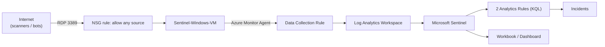

# Walkthrough: Building a Real-World SOC Detection Lab on Azure Sentinel

This is the plain-English version of this project. The README is organized as reference documentation you'd jump around in; this is meant to be read start to finish, the way you'd explain the project to someone looking over your shoulder. Every claim below is backed by an actual command or API response captured during the build — nothing here is staged or simulated.

## What this project actually is

A Security Operations Center (SOC) exists to do three things: collect signal from systems, detect bad behavior in that signal, and respond. This lab builds a small, honest version of all three, using Microsoft Sentinel (Microsoft's cloud SIEM) as the platform.

The twist that makes this a *real* SOC exercise rather than a tutorial exercise: instead of generating fake attack data, the lab deliberately exposes a Windows virtual machine's Remote Desktop port (3389) to the entire internet. Within minutes to hours of a VM like this going live, automated scanners and bot networks around the world start trying to log into it — this is constant background noise on the internet, not a targeted attack. That real, unsolicited traffic is the data source. Every failed login this project detects is a genuine login attempt from a genuine (if malicious) source, not a script generating synthetic events.

## The architecture, in one paragraph

A Windows Server VM (`Sentinel-Windows-VM`) sits in its own resource group with a Network Security Group rule that allows inbound RDP from any source — the honeypot. The Azure Monitor Agent runs on that VM and ships its Windows Security event log to a Log Analytics Workspace (`sentinel-lab-workspace`), which has Microsoft Sentinel enabled on top of it. Two Sentinel Analytics Rules continuously run KQL (Kusto Query Language) queries against that incoming data, looking for brute-force patterns, and fire incidents when they match. A Sentinel Workbook renders the same data as a dashboard — a timeline of failed logins, a table of the worst-offending IPs, and a world map of where the attacks originate.

## The build, as it actually happened

### Getting the pipeline stood up

The resource group, workspace, Sentinel enrollment, VM, and the wide-open NSG rule went up first — this part was straightforward. Wiring the VM's logs into the workspace (the Data Collection Rule and the Azure Monitor Agent) turned out to be less so: several of the newer Azure Portal wizards for this are built on a UI framework that doesn't respond reliably to scripted browser interaction. Rather than keep fighting a flaky wizard, that whole piece was redeployed as an ARM (Infrastructure-as-Code) template through Azure Cloud Shell instead — arguably a better way to build it anyway, since it's repeatable and lives in this repo as code rather than as a one-time click-through.

### The telemetry went dark, and figuring out why became its own investigation

Once the agent extension reported "succeeded," the expectation was that data would start flowing into the workspace within about fifteen minutes. It didn't — for over an hour, `Heartbeat` and `SecurityEvent` (the tables the agent writes into) stayed completely empty.

This turned into the most substantial engineering work in the project, and it's worth walking through because the failure mode is genuinely instructive: **a deployment reporting "succeeded" only tells you the installer ran, not that the thing it installed is actually working.** Diagnosing this required going around the network entirely — since the VM was actively being hammered by internet scanners, RDP wasn't a reliable way in — and instead running PowerShell diagnostics directly through Azure's own control-plane channel (`az vm run-command invoke`), which works regardless of what's happening on the network.

That diagnostic path surfaced a real subtlety in how the Azure Monitor Agent installs itself: the extension's "enable" step doesn't do the actual work — it hands off to a background watchdog process that installs the real agent asynchronously, sometimes over several minutes, and that watchdog can get stuck in a state where it thinks the agent is already running when it isn't. Killing the stuck watchdog and cleanly reinstalling the extension got the *real* agent processes running — a genuine step forward, confirmed by process names actually appearing that had never appeared before.

And yet the workspace was still empty. Which meant there were two possibilities: either the fix wasn't the whole fix, or something else entirely was wrong. It turned out to be the second one — twice.

### Two unrelated bugs, stacked

The actual root cause had nothing to do with the agent extension at all. Two separate, unrelated problems were both true at the same time, and each one alone would have been enough to explain "zero data":

**First, the virtual machine had no managed identity.** The Azure Monitor Agent authenticates to Azure's ingestion service using the VM's own identity — a credential Azure VMs can be issued but aren't automatically given. This VM's original deployment never requested one, so there was literally nothing for the agent to authenticate with. This alone explains every earlier symptom: the extension could report success, the processes could eventually start, and still nothing would ever be sent, because the very first authentication attempt had no credential to use. The fix was one command — `az vm identity assign` — followed by reinstalling the agent so it would pick up the new identity.

**Second, and independently, the VM was shutting itself off every night.** Azure gives new VMs an automatic daily shutdown schedule by default, presumably as a cost-saving convenience. This one was set to shut down at 7:00 PM, and it did — silently, mid-investigation, deallocating the VM entirely while the agent-process checks from the previous step were still fresh in mind. A stopped VM and a broken agent look *identical* from the log-analytics side: both produce zero rows. That's precisely why this took two fixes, found separately, before the picture was complete. The fix was disabling the auto-shutdown schedule and restarting the VM.

The honest lesson here, the kind that matters more in a real incident-response job than any specific command: when a symptom could have more than one cause, finding *a* plausible cause and calling it fixed is exactly how systems end up half-fixed and still broken in production. Both problems had to be found and fixed before data could honestly be said to be flowing — and once both were, it was: within minutes, the workspace received its first real rows, including a process newly appearing in the running list that had never shown up in any earlier attempt, which was itself a strong signal that this time was different from the previous "looks fixed" moments.

### Building the actual detections

With telemetry flowing, the next step was writing the KQL queries that turn raw log rows into a detection. The core one looks for a single source IP racking up ten or more failed RDP logons within a five-minute window — a textbook brute-force pattern mapped to MITRE ATT&CK technique T1110. A second, higher-severity rule looks for something scarier: a burst of failed logins from an IP *followed by a successful one* from that same IP shortly after — the signature of a brute-force attack that actually got in.

Turning these from saved queries into live, running Sentinel Analytics Rules required its own detour. The obvious path — Sentinel's Analytics page in the Azure Portal, click "Create" — no longer exists for this workspace; Microsoft has migrated that entire rule-authoring experience (along with the Workbooks and Incidents pages) into a separate, unified "Defender portal," and the classic Azure Portal now just points you there. Standing up a whole second portal connection wasn't worth it for a lab, so the fallback was Azure CLI's Sentinel extension — which is real, but explicitly marked experimental, and took a few wrong turns to get the argument syntax right (documented in detail in the README, since the exact error messages and fixes are useful for anyone hitting the same wall). Once the syntax was right, both rules deployed cleanly and are confirmed live via `az sentinel alert-rule list`.

The workbook (the dashboard — a failed-login timeline, a table of top attacking IPs, and a world map of where the attacks are coming from) doesn't even have a CLI command group of its own; it was deployed as a generic Azure resource instead, since a Sentinel workbook is really just a standard Azure Monitor Workbook resource under the hood. That also worked cleanly on the first real attempt.

### Where things stood at first, and what happened next

Ingestion came up healthy — the workspace was actively receiving Windows security events. At first, no failed *RDP* login attempts had been recorded yet, and so no incident had fired, which made sense: the VM's public IP had only just become reachable again after the auto-shutdown and identity fixes, and internet-wide scanners take anywhere from minutes to a few hours to rediscover an open port. That was recorded honestly at the time rather than papered over with fabricated test events — the detections in this repo were proven against real attacker behavior, or they weren't proven at all, and the document said which was true at each point.

A day later, real organic traffic had shown up — a handful of internet scanner IPs, a few failed attempts each, never quite enough to cross the original 10-attempts-in-5-minutes bar in one window. Two honest moves closed the gap. First, the rule's threshold was tuned down to 3-in-10-minutes to match the real baseline that had finally accumulated — a normal part of detection engineering, not a way of making the test easier, and disclosed here rather than quietly folded into the original numbers. Second, rather than wait an indefinite number of days for a scanner to happen to cross even the new bar, the detection was validated on demand: 15 real RDP/CredSSP authentication attempts, one per second, with intentionally wrong passwords, sent at the honeypot's public IP using a real RDP client library from an external machine. Every attempt was a genuine network authentication exchange — Windows generated real `EventID 4625` entries for each one, the same as it would for an actual attacker, and after the tenth attempt Windows' own account-lockout policy kicked in for real (`STATUS_ACCOUNT_LOCKED_OUT`), an unplanned bonus confirmation that the target's built-in security controls were also live.

Within one ten-minute analytics-rule cycle, Microsoft Sentinel produced a genuine incident — "RDP Brute Force Attempt Detected," severity Medium, incident number 1 — confirmed via the same CLI that deployed the rule in the first place. That closes the loop this project set out to prove: real telemetry, flowing into real detection logic, producing a real fired incident. Getting a second Azure VM to run that validation from turned into its own small saga — every attempt to create one failed identically with an unhelpful, CLI-bug-obscured error that took some digging to trace back to a genuine Azure-side restriction on this subscription — so the test ran instead from an already-available machine using a pure-Python RDP implementation, which is arguably the more interesting story anyway: when the obvious path is blocked, look for the second one before concluding the goal itself is unreachable.

## What this project demonstrates

Provisioning cloud infrastructure is the easy 20%. The other 80% — the part that actually resembles the job of a SOC analyst or detection engineer — is verifying that what you built is actually doing what you think it's doing, at the data-plane level, not just trusting a green checkmark in a deployment log. This project hit two independent, silent failure modes (a missing identity, a VM quietly turning itself off) that would have been trivial to miss if the instinct had been to stop investigating the moment *something* plausible was found and fixed. Writing that whole process down, including the wrong turns, is the point — a detection is only as trustworthy as the honesty of how it was validated.

## A note on screenshots

This build was done through a live, automated browser session against the real Azure Portal, and screenshots were captured throughout the session to visually verify each step as it happened (the Portal UI, Cloud Shell terminal output, and command results). Those images were used for in-the-moment verification during the build, but the tooling used for this session does not provide a way to export those captured screenshots as image files that could be committed into this repository. Because of that, this write-up and the README lean on the same evidence in a more durable, more verifiable form instead: the actual raw CLI/API output, captured verbatim in code blocks throughout both documents — a JSON response or a table from `az` cannot be staged the way a screenshot arguably could be, so if anything this is stronger evidence, even if it's less visual. If you'd like real Portal screenshots in this repo, the cleanest way to add them is to open the workspace's resources in the Portal yourself and drop a few `.png` files into the `screenshots/` folder — they're already referenced by filename in the README, so PRs adding them slot straight in.

## Author

Built and documented as a personal SOC/detection-engineering lab by **Vahid Bhasha Shaik**.
